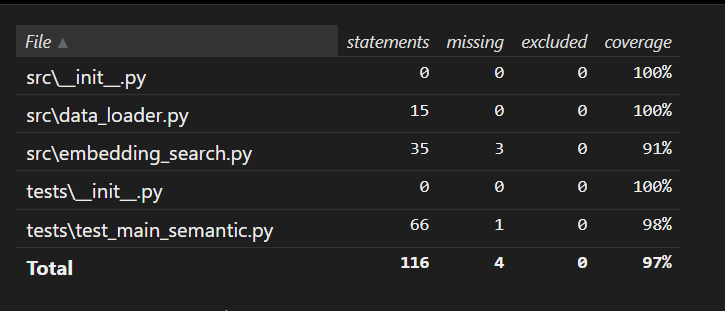

### PROYECTO DE BUSCADOR DE PELÍCULAS SEMÁNTICAS

Este proyecto te permitirá adquirir conocimientos fundamentales sobre el uso de Git y Docker, mientras te introduces en el fascinante campo del Procesamiento del Lenguaje Natural (NLP). Utilizando vectores semánticos y la tecnología de Hugging Face, aprenderás cómo funcionan las herramientas detrás de innovaciones como ChatGPT, LLaMA y Google, aplicadas al desarrollo de un buscador de películas inteligente.

## PASOS PARA CORRER PROYECTO

# Requisitos
Antes de ejecutar el proyecto, asegúrate de tener instalado lo siguiente:

Git: Para clonar el repositorio y gestionar el control de versiones.
 
Python 3.10 o superior: Para ejecutar el código del proyecto.
 
Docker : Para crear y correr el contenedor del proyecto.
 
Visual studeo code : Recomendado para editar y gestionar el código.

## Instrucciones

# clonar proyecto
git clone url-del-repositorio
# acceder al proyecto
cd app
# correr proyecto docker en terminal
# crear imagen
Asegúrate de tener Docker Desktop abierto antes de ejecutar el siguiente comando:
docker build -t nombreproyecto .   
# correr docker
docker run -it nombreproyecto   ó   docker run -d nombreproyecto
# Verificar que el contenedor esté corriendo:
Para comprobar que el contenedor se está ejecutando correctamente, puedes listar los contenedores activos con el siguiente comando:
docker ps

## PASOS PARA CORRER test_main_semantic.py

# acceder al proyecto
cd app

# crear entorno virtual
python -m venv env
ó
virtualenv env

# activar entorno 
En Windows: source env/Scripts/activate
En Linux/MacOS: source env/bin/activate

# Instalacion de las librerias
pip install -r requirements.txt

# Correr test
pytest test/tes_main_semantic.py

# Generar reporte
* coverage run -m unittest discover (comando para guardar un reporte en memoria de todo el código)
* coverage report  (comando para guardar un reporte en el proyecto)
* coverage html    (comando para generar una carpeta que nos permite ver el reporte en una pagina html)

# Información adicional sobre Semantic_search_studients_M.ipynb

En este proyecto se realizó un Análisis Exploratorio de Datos (EDA) para comprender mejor el conjunto de datos y extraer información clave. Además, se llevaron a cabo diversas pruebas sobre cada una de las líneas de código para optimizar su funcionamiento y garantizar que el desarrollo fuera el más eficiente posible.

El código resultante de este análisis y pruebas fue integrado en el archivo principal main_students.py, con el objetivo de mejorar su desempeño y funcionalidad en el contexto del proyecto.

## Estructura del Proyecto

### Separación de Responsabilidades

- **DataLoader**: Se ha creado una clase `DataLoader` responsable de la carga de datos desde diferentes fuentes. Esta clase se encarga de manejar la lectura de archivos CSV y cualquier error relacionado con la carga de datos.
  
- **EmbeddingSearch**: La lógica de búsqueda se mantiene en la clase `EmbeddingSearch`, que se encarga de crear embeddings y realizar comparaciones de similitud entre ellos.

### Interfaz para Búsqueda

- **SimilaritySearchInterface**: Se ha definido una interfaz `SimilaritySearchInterface` que especifica la funcionalidad que cualquier motor de búsqueda debe implementar. Esto permite que diferentes motores de búsqueda sean intercambiables en el futuro.

### Clase Principal

- **MovieSearchApp**: Se ha implementado la clase `MovieSearchApp`, que gestiona la interacción del usuario. Esta clase orquesta la carga de datos utilizando `DataLoader` y realiza búsquedas a través de una instancia de `SimilaritySearchInterface`.

### Inyección de Dependencias

- **Inyección de Dependencias**: La clase `MovieSearchApp` recibe instancias de `DataLoader` y `SimilaritySearchInterface` como argumentos. Este enfoque permite modificar o extender fácilmente la funcionalidad de la aplicación sin alterar la lógica existente, promoviendo así un diseño más limpio y modular.

## Uso

Para utilizar la aplicación, asegúrate de tener todas las dependencias instaladas y sigue estos pasos:

1. **Cargar los Datos**:
   - La clase `DataLoader` se encargará de cargar los datos necesarios para la búsqueda.

2. **Realizar Búsquedas**:
   - Puedes interactuar con la clase `MovieSearchApp` para realizar búsquedas utilizando el término que desees.

## Explicacion de algunas lineas de código en el archivo de test_main_semantic.py

# El decorador @patch:
El decorador @patch proviene del módulo unittest.mock de Python y se usa para simular (mockear) funciones o métodos de manera que no se ejecuten realmente durante la prueba, sino que se les dé un comportamiento controlado.
Esto reemplaza temporalmente el método encode de la clase SentenceTransformer de la librería sentence_transformers con un objeto mock (simulado) durante la ejecución de la función de prueba (test_create_embeddings).

# mock_encode:
La función de prueba test_create_embeddings tiene un argumento adicional mock_encode que es pasado automáticamente por el decorador @patch. Este es el mock que reemplaza al método original SentenceTransformer.encode durante la ejecución de esta prueba. Puedes controlar cómo se comporta el mock en la prueba.

# Imagen de mi coverage html

